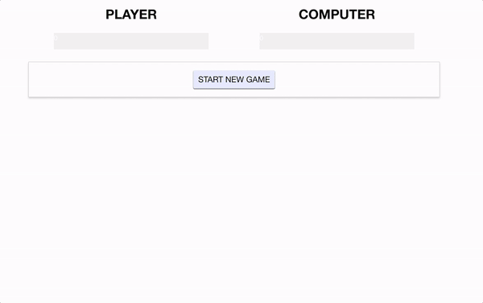

# WEB 2630 Vue RPS
> Your project is to create the classic game of Rock, Paper, Scissors (RPS) using VueJS. You will only be using what we have covered in class.

## Project 
General
* Only Show Player with Win Bar and Computer with Win Bar
* Only Show Start New Game Button
Player and Computer Win Bars
* Show Player and Computer Wins
*Use Dynamic CSS For Win Progress Bar
Start New Game
* Show Options to Begin Playing
* Hide Start Game Button Show Game Functionality Buttons
Game Functionality
* Rock | Paper | Scissors
  * Compare User Choice with Computer
  * Update Wins
  * Show Outcome in Log
    * ex: Computer Chose Scissors | Rock Beats Scissors | Player Wins!
  * First to 10 Wins
    * Display User Win | Loss Status
    * End Game
  * Restart
    * Reset Everything 
    * Let User Start New Game

## Part 1 Submission

1. Create WEB2630_VueRPS Repository on GitHub
    * Note: Make Repository Private
2. Open Terminal or Command Prompt
    1. Clone Template
        * git clone --bare https://github.com/CodySquadroni/WEB2630_VueRPS
            * Note: Make sure to 'cd' to a directory you want it downloaded to.
    2. cd Into WEB2630_VueRPS.git
    3. Copy Template Into Your Repository
        * git push --mirror https://github.com/GITHUB_USERNAME/WEB2630_VueRPS
            * Note: Make sure to put your GitHub Username in place of GITHUB_USERNAME
    4. Remove Copy WEB2630_Exercise1.git
    5. Clone Your GitHub Repository
        * git clone https://github.com/GITHUB_USERNAME/WEB2630_Exercise1
3. Start The Project Requirements From Above
4. Submit Your GitHub URL
    * For Part 1, you just need to have something submitted to show your progress. You will have more time to finish the project for Part 2.

## Part 2 Submission

1. Complete The Project Requirements From Above
2. Live Host VueRPS on Netlify
3. Submit Your GitHub and Netlify URL

**Note: Remember to make your GitHub repository private and add me as a collaborator GitHub username: CodySquadroni**

## Final Outcome

